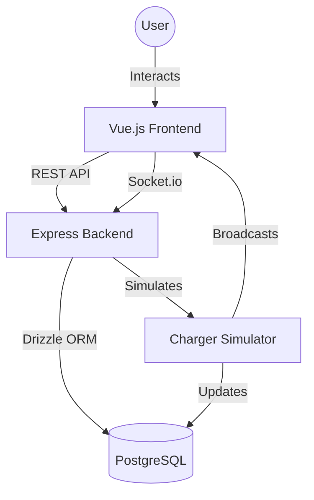

## System Architecture

The system follows a classic full-stack architecture with real-time capabilities:
- **Frontend (Vue.js)**: Communicates with the Backend via REST API for actions (start/stop) and via Socket.io for live updates.
- **Backend (Node.js/Express)**: Handles business logic, session management, and broadcasts updates.
- **Database (PostgreSQL)**: Persists session data.
- **Simulator**: A logic layer within the backend that periodically updates active sessions.

## Components

### Backend (Node.js + Express)
- **App/Server**: Entry point, configures Express and Socket.io.
- **Session Controller**: Handles REST endpoints for `GET /api/sessions`, `POST /api/sessions/:id/start`, and `POST /api/sessions/:id/stop`.
- **Simulator Engine**: A periodic task (e.g., `setInterval`) that finds all `charging` sessions and increments their `energyKwh`.
- **Database Layer**: Drizzle ORM schemas and connection logic.

### Frontend (Vue.js 3)
- **Dashboard View**: Main page showing real-time stats and the list of sessions.
- **Socket Service**: Manages the connection to the backend and updates a reactive store.
- **Session Component**: Displays individual session details and control buttons.

## Data Model

### `sessions` table
- `id`: `serial` (Primary Key)
- `chargerId`: `text` (Identifier for the charger, e.g., 'CH-001')
- `status`: `text` ('idle', 'charging', 'finished')
- `energyKwh`: `real` (Accumulated energy)
- `startTime`: `timestamp` (When charging started)
- `endTime`: `timestamp` (When charging stopped)
- `cost`: `real` (Calculated as `energyKwh * 2.5`)
- `createdAt`: `timestamp` (Record creation time)

## External Dependencies

- **Frameworks**: Express (Backend), Vue 3 (Frontend).
- **ORM**: Drizzle ORM + `pg` driver.
- **Real-time**: Socket.io + Socket.io-client.
- **Styling**: Tailwind CSS.
- **Containerization**: Docker, Docker Compose.
